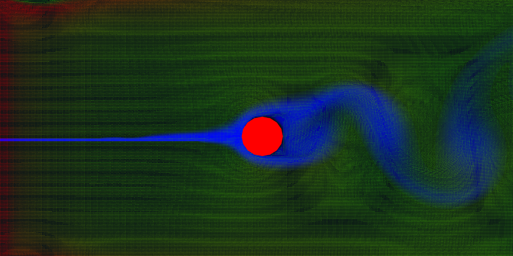
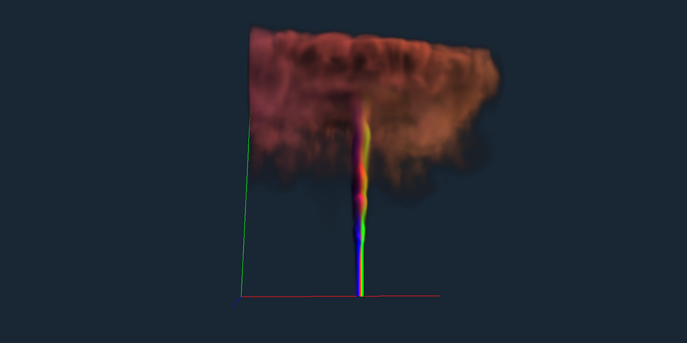

    

# SmokeSim

**Real-time 2D & 3D GPU-accelerated smoke simulation in C.**

---

## 💨 Overview

SmokeSim is a real-time 2D and 3D smoke simulation written in **C** using **OpenGL4.6**, designed to run entirely on the GPU.
By utilizing a **multigrid V-cycle solver** to solve the Navier-Stokes incompressible fluid equations, high-resolution fluid dynamics can be efficiently achieved.
Featuring a [`nuklear.h`](https://github.com/Immediate-Mode-UI/Nuklear) GUI for dynamic obstacles & emitters creation / deletion in real-time for immense flexibility.

&nbsp;

## 🚀 Optimization Sidequest

> **Test hardware:** Intel core i5-10500, NVIDIA RTX 3070, 32GB RAM

The most significant optimization in this project was the transition from a standard Gauss-Seidel solver to a **multigrid V-cycle** solver.

Simulating smoke requires solving a massive system of linear equations. While Gauss-Seidel is one of the most straightforward methods to do this, it is notoriously slow at converging.
A much better approach is the multigrid V-cycle solver. As the name suggests, it utilizes a multiple grid system at varying resolutions with Gauss Seidel run for fewer iterations at every resolution
and with values interpolated and propagated back through the finer and coarser grids.

**So, how much does this actually improve performance?**
* **Bare Gauss-Seidel:** Achieved ~30 FPS on a `64x64x64` grid.
* **Multigrid V-Cycle + Gauss-Seidel:** Achieved ~30 FPS on a `128x128x128` grid.

You might be tempted to call that a 100% performance improvement, which is already pretty good, but if you look closer at the math:
* A `64x64x64` grid contains **262,144 cells**.
* A `128x128x128` grid contains **2,097,152 cells**.

That is **8 times more cells** being simulated at the exact same framerate. It's an impressive leap in efficiency, an 800% performance increase.

## 🛠️  Building

*(instructions coming soon)*

### Windows

### Linux