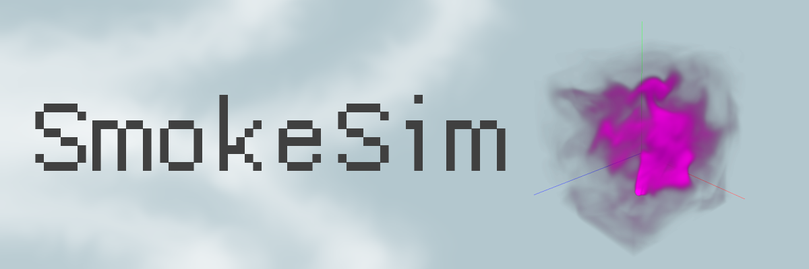
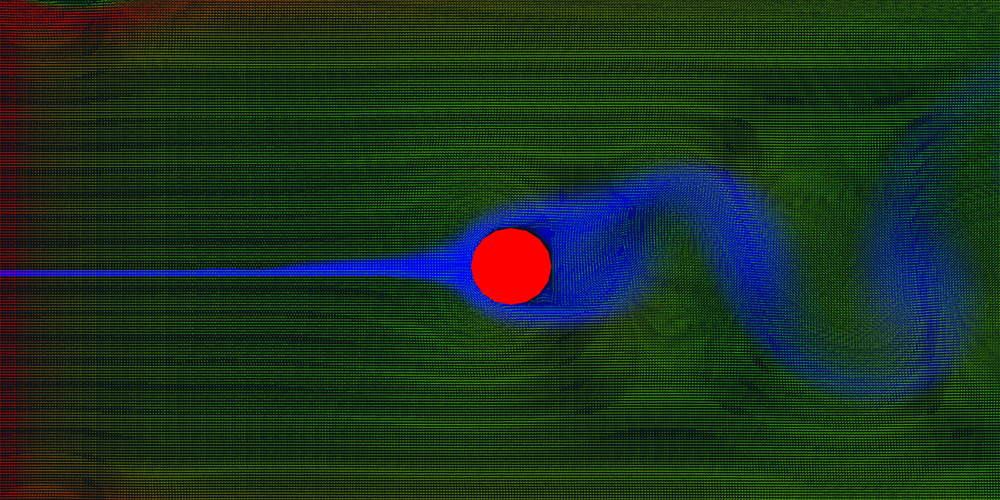
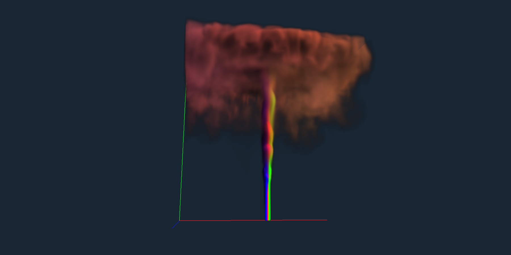

<div align="center">
    
</div>

# SmokeSim


**Real-time 2D & 3D GPU-accelerated smoke simulation in C.**

---

## 💨 Overview

SmokeSim is a real-time 2D and 3D smoke simulation written in **C** using **OpenGL4.6**, designed to run entirely on the GPU.
By utilizing a **multigrid V-cycle solver** to solve the Navier-Stokes incompressible fluid equations, high-resolution fluid dynamics can be efficiently achieved.
Featuring a [`nuklear.h`](https://github.com/Immediate-Mode-UI/Nuklear) GUI for dynamic obstacles & emitters creation / deletion in real-time for immense flexibility.

<div align="center">

&nbsp;


</div>

## Usage

> [!NOTE]
> Smoke simulation requires decent hardware.

### Keybinds

- `S` Open/Close settings
- `P` Pause / Unpause simulation
- `O` Toggle orbit mode (Spin around the simulation)
- `A` Toggle auto-orbit mode (Auto spin around the simulation)
- `SCROLL_WHEEL_UP` Move forward / Zoom in
- `SCROLL_WHEEL_DOWN` Move backwards / Zoom out
- `MOUSE_MOVEMENT` Camera movement / Orbit panning


> [!IMPORTANT]
> Settings marked with a warning symbol `⚠` are advanced — change only if you know what you're doing.

### Grid Settings

- `Cellsize` Physical size of each cell

### Physics settings

- `Time_step` Time between iterations (smaller = more accurate, slower)
- `Density ⚠` Smoke particles density
- `T_ambient` Ambient temperature
- `T_weight_coefficient` Gravity effect factor
- `T_temp_coefficient` Temperature effect factor
- `Vorticity Confinement` Swirl / curl strength

> Shown only if the grid is **NOT** enclosed

- `Wind x/y/z` Wind strength

### Graphics settings

- `Ambient_color` Background draw color
- `Objects_color` Objects draw color
- `Light_color` Light color. Multiplied x1.5
- `Light_direction (x/y/z)` Light (sun) direction
- `Smoke_density_factor` Smoke density multiplier in ray marcher
- `Shadow_density_factor` Smoke density multiplier in shadow ray marcher
- `Step_size` Distance between every step in ray marcher (smaller = more accurate, slower)
- `Shadow_step_factor` Shadow_step_size = step_size * shadow_step_factor
- `Shadow_steps` Amount of shadow steps
- `Z_near ⚠` Projection matrix z_near value
- `Z_far ⚠` Projection matrix z_far value
- `FOV ⚠` Projection matrix FOV value

## [Flavortown](https://flavortown.hackclub.com/kitchen)'s Optimization Sidequest

> [!NOTE]
> **Test hardware:** Intel core i5-10500, NVIDIA RTX 3070, 32GB RAM

The most significant optimization in this project was the transition from a standard Gauss-Seidel solver to a **multigrid V-cycle** solver.

Simulating smoke requires solving a massive system of linear equations. While Gauss-Seidel is one of the most straightforward methods to do this, it is notoriously slow at converging.
A much better approach is the multigrid V-cycle solver. As the name suggests, it utilizes a multiple grid system at varying resolutions with Gauss Seidel run for fewer iterations at every resolution
and with values interpolated and propagated back through the finer and coarser grids.

**So, how much does this actually improve performance?**
* **Bare Gauss-Seidel:** Achieved ~30 FPS on a `64x64x64` grid.
* **Multigrid V-Cycle + Gauss-Seidel:** Achieved ~30 FPS on a `128x128x128` grid.

You might be tempted to call that a 100% performance improvement, which is already pretty good, but if you look closer at the math:
* A `64x64x64` grid contains **262,144 cells**.
* A `128x128x128` grid contains **2,097,152 cells**.

That is **8 times more cells** being simulated at the exact same framerate. It's an impressive leap in efficiency, roughly an **800%** performance increase.

---

Another smaller gain came from the use of shared memory in obstacles handling shaders. With `1000x` obstacles in a `64x128x64` grid average FPS increased ~31%.
While it is rare for a simulation to feature more than ~5 obstacles, this optimization might provide helpful in future versions with new features.

## Building

> [!CAUTION]
> You must have an OpenGL 4.6 compatible graphics card to run this.

### Prerequisites

- [CMake](https://cmake.org/) 3.27+
- A C11-compatible compiler (MSVC, GCC or Clang)
- [GLFW3](https://www.glfw.org/download.html) (static library)
- [FreeType](https://freetype.org/download.html)
- [CGLM](https://github.com/recp/cglm)

### Windows

1. **Install dependencies**

    >You might need to copy `freetype.dll` `glfw.dll` next to `SmokeSim.exe`.

    ```powershell
      vcpkg install glfw3 freetype cglm
    ```
   
2. **Clone the repository**

    ```powershell
       git clone https://github.com/Fakeeeea/SmokeSim.git
       cd SmokeSim
    ```
   
3. **Configure and build**
    ```powershell
       cmake -B build `
       -DCMAKE_BUILD_TYPE=Release `
       -DCMAKE_TOOLCHAIN_FILE=[path-to-vcpkg]/scripts/buildsystems/vcpkg.cmake
   
       cmake --build build --config Release
    ```
4. **Run**
   ```powershell
       cd build
      ./SmokeSim.exe
    ```
   
### Linux

>[!WARNING]
> **Arch Users:** [CGLM](https://github.com/recp/cglm) must be manually installed.

1. **Install dependencies**

    ```bash
      #Debian / Ubuntu
      sudo apt install cmake gcc libglfw3-dev libfreetype-dev libcglm-dev libgl1-mesa-dev
      
      #Arch
      sudo pacman -S cmake gcc glfw freetype2
    ```

2. **Clone the repository**
    ```bash
       git clone https://github.com/Fakeeeea/SmokeSim.git
       cd SmokeSim
    ```

3. **Configure and build**
    ```bash
       cmake -B build -DCMAKE_BUILD_TYPE=Release
       cmake --build build
    ```

4. **Run**
   ```bash
       cd build
      ./SmokeSim
    ```